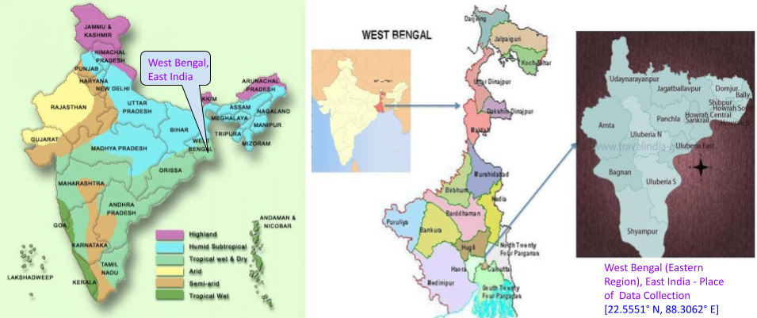

# Computational Solar Energy - Ensemble Learning Methods for Prediction of Solar Power Generation based on Meteorological Parameters in Eastern India

This joint project is a collaboration between [BITS Pilani](https://www.bits-pilani.ac.in/) and [IIEST (Shibpur)](https://www.iiests.ac.in/), India, Asia

Project Members - [Debojyoti Chakraborty](https://www.linkedin.com/in/debojyoti-chakraborty-ba03a4179/?originalSubdomain=in) [(Infosys AI and Automation, Bangalore)](https://www.infosys.com/), [Jayeeta Mondal](https://scholar.google.com/citations?user=lW7H0AoAAAAJ&hl=en) [(TCS Research, Kolkata)](https://www.tcs.com/what-we-do/research), [Hrishav Bakul Barua](https://www.researchgate.net/profile/Hrishav-Barua)  [(TCS Research, Kolkata)](https://www.tcs.com/research-and-innovation), and [Ankur Bhattacharya](https://universe.bits-pilani.ac.in/Hyderabad/bhattacharjee/Profile) [(BITS Pilani, Hyderabad)](https://www.bits-pilani.ac.in/)

[Link to the paper](https://www.sciencedirect.com/science/article/pii/S1755008423000078)!!

# Table of Contents

1. [Overview](#Overview)
2. [The Prediction Framework](#The-Prediction-Framework)
3. [Dataset](#Dataset)
4. [Pretrained Models](#Pretrained-Models)
5. [Running the ML Models](#Running-the-ML-Models)
6. [Citation](#Citation)
7. [License and Copyright](#License-and-Copyright)

## Overview

The official implementation of our Solar Power Prediction Testbed Benchmark:  
 
The complete bird’s eye view of the proposed Testbed Framework depicting the workflow for Data Collection/Curation, Data Mining/Analytics and Supervised Learning Methods study, analysis, and experimentation on custom regional meteorological data (here data from East India) for Solar power forecasting and prediction.

Please see the paper for more details.

##  The Prediction Framework

Our generic prediction framework which is used for all the machine learning (ML) models we use in this study: 

Here, we use a set of customized, trained, and tested Ensemble Learning models. Please see the paper for more details. 

Please check the [Codebase](src) for training and testing the ML models.

> **_NOTE:_**  The experimental setup and computing resourses used.

##  Dataset

The place (in West Bengal (WB), East India) for Data collection (depicted in map: 22.5551° N, 88.3062° E) with general meteorological conditions (Pictures collected from Google Images).

We acquired the solar power generation data with consequent meteorological  parameter measurement data from Solar Radiation Resource Assessment site [(SRRA)](http://dst-iiestsolarhub.org.in/about_SRRA.php) established (in 2014) in the roof top of Indian Institute of Engineering Science and Technology (IIEST), Shibpur, West Bengal (WB), East India. It is a part of [DST-IIEST Solar Photovoltaic (PV) Hub](http://dst-iiestsolarhub.org.in/about_DST_IIEST_solar_hub.php) which happens to be a joint initiative by [Department of Science and Technology (DST), Government of India](https://dst.gov.in/) and [Centre of Excellence for Green Energy and Sensor Systems (CEGESS)](https://oldwww.iiests.ac.in/index.php/home-g), Indian Institute of Engineering Science and Technology (IIEST), Shibpur.

Please check the [Codebase](src) for data pre-processing and analysis. This also contains the code for Feature Selection and Dimentionality Reduction.

> **_NOTE:_**  Kindly fillup the agreement form to get access to the novel Meteorological Dataset used in this work.

Please fillup the [Dataset Agreement Form](https://drive.google.com/file/d/1ksj2pvd_eTuGq056TiSCD8wiDI_XEX9z/view?usp=sharing) and mail to [Hrishav Bakul Barua](https://www.researchgate.net/profile/Hrishav-Barua) (hbarua@acm.org) to get access.

##  Pretrained Models

> **_NOTE:_**  Kindly drop a mail to [Hrishav Bakul Barua](https://www.researchgate.net/profile/Hrishav-Barua) (hbarua@acm.org) to get access to the pretrained models.

##  Running the ML Models

Need Help with the Code!! Don't worry we got your back :) 

Here is how you can train/test the models from scratch. 

1) Install dependencies and setup the environment 

~~~
pip3 install requirements.txt
~~~

2) Data Processing and Analysis

~~~
Run notebook Data_analysis.ipynb
~~~

3) Train

~~~
Run notebook Train_ensemble_methods.ipynb
~~~

4) Test

~~~
Run notebook Test_ensemble.ipynb
~~~

##  Citation 

If you find our work (i.e. the code, the theory/concept, or the dataset) useful for your research or development activities, please consider citing our work as follows:

~~~
@article{CHAKRABORTY2023277,
title = {Computational solar energy – Ensemble learning methods for prediction of solar power generation based on meteorological parameters in Eastern India},
journal = {Renewable Energy Focus},
volume = {44},
pages = {277-294},
year = {2023},
issn = {1755-0084},
doi = {https://doi.org/10.1016/j.ref.2023.01.006},
url = {https://www.sciencedirect.com/science/article/pii/S1755008423000078},
author = {Debojyoti Chakraborty and Jayeeta Mondal and Hrishav Bakul Barua and Ankur Bhattacharjee},
keywords = {Solar PV, Ensemble learning, Meteorological Data, Power prediction},
abstract = {The challenges in applications of solar energy lies in its intermittency and dependency on meteorological parameters such as; solar radiation, ambient temperature, rainfall, wind-speed etc., and many other physical parameters like dust accumulation etc. Hence, it is important to estimate the amount of solar photovoltaic (PV) power generation for a specific geographical location. Machine learning (ML) models have gained importance and are widely used for prediction of solar power plant performance. In this paper, the impact of weather parameters on solar PV power generation is estimated by several Ensemble ML (EML) models like Bagging, Boosting, Stacking, and Voting for the first time. The performance of chosen ML algorithms is validated by field dataset of a 10kWp solar PV power plant in Eastern India region. Furthermore, a complete test-bed framework has been designed for data mining as well as to select appropriate learning models. It also supports feature selection and reduction for dataset to reduce space and time complexity of the learning models. The results demonstrate greater prediction accuracy of around 96% for Stacking and Voting EML models. The proposed work is a generalized one and can be very useful for predicting the performance of large-scale solar PV power plants also.}
}
~~~

## License and Copyright

~~~
----------------------------------------------------------------------------------------
Copyright 2022 | All the authors and contributors of this repository as mentioned above.
----------------------------------------------------------------------------------------

~~~

Please check the [License](LICENSE) Agreement.

