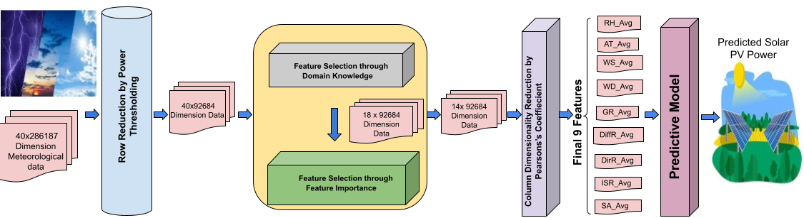

# Computational Solar Energy - Ensemble Learning Techniques for Prediction of Solar Power Generation based on Meteorological Parameters in Eastern India

<h2> The official implementation of our Solar Power Prediction Test bed.  </h2>

The complete bird’s eye view of the proposed Test bed Framework depicting the workflow for Data Collection/Curation, Data Mining/Analytics and Supervised Learning Methods study, analysis, and experimentation on custom regional meteorological data (here data from East India) for Solar power forecasting and prediction.

<h2> The place (in West Bengal (WB), East India) for Data collection (depicted in map: 22.5551° N, 88.3062° E) with general meteorological  conditions (Pictures collected from Google Images).  </h2>

<h2> Our generic prediction framework which is used for all the learning models we use in this study. </h2>

> **_NOTE:_**  The experimental setup and computing resourses used.

1) Install dependencies

 \fbox{My text!}

2) Data Processing and Analysis

 \fbox{My text!}

3) Train

 \fbox{My text!}

4) Test

 \fbox{My text!}

