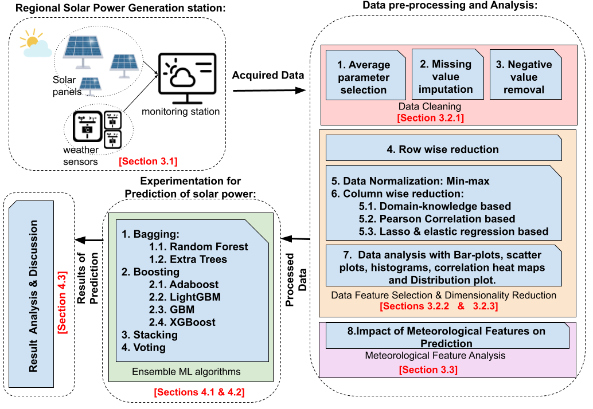

# Computational Solar Energy - Ensemble Learning Techniques for Prediction of Solar Power Generation based on Meteorological Parameters in Eastern India

This joint project is a collaboration between [BITS Pilani](https://www.bits-pilani.ac.in/), [TCS Research (Kolkata)](https://www.tcs.com/research-and-innovation), [Infosys (Bangalore)](https://www.infosys.com/), and [IIEST (Shibpur)](https://www.iiests.ac.in/), India, Asia

Project Members - [Debojyoti Chakraborty](https://www.linkedin.com/in/debojyoti-chakraborty-ba03a4179/?originalSubdomain=in), [Jayeeta Mondal](https://scholar.google.com/citations?user=lW7H0AoAAAAJ&hl=en), [Hrishav Bakul Barua](https://www.researchgate.net/profile/Hrishav-Barua), and [Ankur Bhattacharya](https://universe.bits-pilani.ac.in/Hyderabad/bhattacharjee/Profile)

Link to the paper : [Pre-print]{}

# Table of Contents

1. [Overview](#Overview)
2. [The Prediction Framework](#The-Prediction-Framework)
3. [Dataset](#Dataset)
4. [Pretrained Models](#Pretrained-Models)
5. [Running the ML Models](#Running-the-ML-Models)
6. [Citation](#Citation)
7. [License and Copyright](#License-and-Copyright)

## Overview

The official implementation of our Solar Power Prediction Testbed Benchmark:  
 
The complete bird’s eye view of the proposed Test bed Framework depicting the workflow for Data Collection/Curation, Data Mining/Analytics and Supervised Learning Methods study, analysis, and experimentation on custom regional meteorological data (here data from East India) for Solar power forecasting and prediction.

Please see the paper for more details.

##  The Prediction Framework

Our generic prediction framework which is used for all the machine learning (ML) models we use in this study: 

Here, we use a set of customized, trained, and tested Ensemble Learning models. Please see the paper for more details. 

> **_NOTE:_**  The experimental setup and computing resourses used.

##  Dataset

The place (in West Bengal (WB), East India) for Data collection (depicted in map: 22.5551° N, 88.3062° E) with general meteorological conditions (Pictures collected from Google Images).

We acquired the solar power generation data with consequent meteorological  parameter measurement data from Solar Radiation Resource Assessment site [(SRRA)](http://dst-iiestsolarhub.org.in/about_SRRA.php) established (in 2014) in the roof top of Indian Institute of Engineering Science and Technology (IIEST), Shibpur, West Bengal (WB), East India. It is a part of [DST-IIEST Solar Photovoltaic (PV) Hub](http://dst-iiestsolarhub.org.in/about_DST_IIEST_solar_hub.php) which happens to be a joint initiative by Department of Science and Technology (DST), Government of India and Centre of Excellence for Green Energy and Sensor Systems (CEGESS), Indian Institute of Engineering Science and Technology (IIEST), Shibpur.

> **_NOTE:_**  Kindly fillup the agreement form to get access to the novel Meteorological Dataset used in this work.

~~~

~~~

##  Pretrained Models

> **_NOTE:_**  Kindly fillup the google form to get access to the pretrained models.

~~~

~~~

##  Running the ML Models

Need Help with the Code!! Don't worry we got your back :) 

Here is how you can train/test the models from scratch. 

1) Install dependencies and Environment Setup

~~~

~~~

2) Data Processing and Analysis

~~~

~~~

3) Train

~~~

~~~

4) Test

~~~

~~~

##  Citation 

If you find our work (i.e. the code, the theory/concept, or the dataset useful in your research or development activities, please cite our paper as follows:

~~~

~~~

## License and Copyright

~~~
----------------------------------------------------------------------------------------
Copyright 2022 | All the authors and contributors of this repository as mentioned above.
----------------------------------------------------------------------------------------

~~~

Please check the [License](LICENSE) Agreement.

